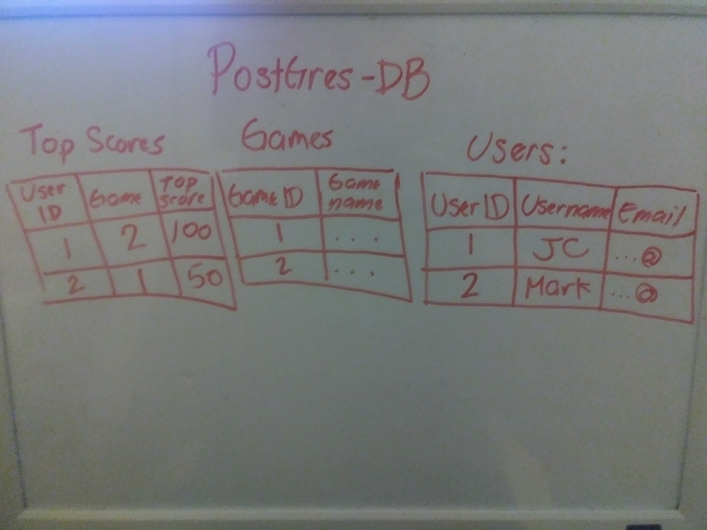

# game-addict

## Author: Joseph Hangarter & Mark Hangarter

## Version: 1.00

### Overview

### Getting Started

### Architecture
* Tools: React, VS code, Github, Node.js, SQL

### API

### UML

### Change Log
